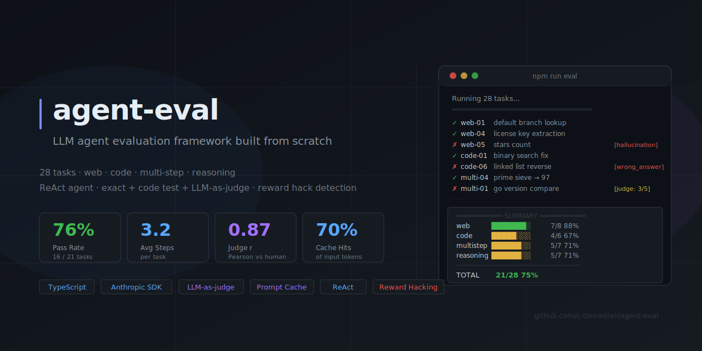

# agent-eval



An evaluation framework for agentic LLMs, built from scratch with the Anthropic SDK. The point isn't the benchmark number — it's finding where the agent breaks and understanding why.

```
Model: claude-sonnet-4-6
Running 28 tasks...

web          7/8  (88%)  — 95% CI: [53%–98%]
code         4/6  (67%)  — 95% CI: [30%–91%]
multistep    5/7  (71%)  — 95% CI: [36%–92%]
reasoning    5/7  (71%)  — 95% CI: [36%–92%]
────────────────────────────────────────────
TOTAL       21/28  (75%) — 95% CI: [55%–88%]
```

The confidence intervals are wide because n=28. That's intentional — they're a reminder that a 75% pass rate on a small eval suite has real uncertainty behind it.

## What's being measured

28 tasks across 4 categories:

| Category | Tasks | What it tests |
|---|---|---|
| **web** | 8 | Fetch real GitHub API endpoints, extract specific fields. Does the agent actually call tools or hallucinate from training data? |
| **code** | 6 | Fix intentionally buggy Python/Go files. The agent must read, diagnose, write, and verify with the shell. |
| **multistep** | 7 | Chain multiple tool calls: compare 3 repos, write + run a script, build a report from 3 APIs. |
| **reasoning** | 7 | Logic puzzles with no tools. Water jug problem, mislabeled boxes, CRT trick questions. |

Scoring is intentionally mixed:
- `exact`/`contains`/`regex` — deterministic, for tasks with a known correct answer
- `code_test` — run the actual test suite, pass or fail
- `judge` — LLM-as-judge (claude-haiku-4-5) for open-ended tasks, with a per-task rubric

## Failure modes caught in practice

### Hallucination (no tools used)

`web-05` asks for bubbletea's current star count. The agent answered "approximately 28,000 stars" without calling `fetch`. That number comes from training data, which has a knowledge cutoff. It might be right, it might be stale — either way, it's not what was asked.

The hallucination detector flags this: if a task provides tools and the agent answers without using any, it's classified as `hallucination` regardless of whether the answer happens to be correct. This is the right call for an eval — you want to know if the agent can use tools, not if it got lucky.

### Wrong fix (code-06)

The linked list `Reverse()` function had an obvious bug — the comment even said "bug: forgets to advance cur, causing infinite loop." The agent spotted it and added `cur = cur.Next`. But it put that line in the wrong place:

```go
// what the agent wrote:
prev = cur
cur.Next = prev   // now cur points to itself
cur = cur.Next    // follows the self-pointer → infinite loop
```

The correct three-pointer pattern is:

```go
next := cur.Next
cur.Next = prev
prev = cur
cur = next
```

Spotting the symptom isn't the same as fixing it correctly. The agent ran the tests, got a timeout, and on step 6 reported "FINAL ANSWER: fixed" anyway. Failure mode: `wrong_answer`. This one is worth showing in an interview — it demonstrates that the eval isn't just testing "does the agent try."

### Partial multi-step (multi-01)

Compare Go version requirements across three repos by fetching their go.mod files. The agent fetched two of the three and then wrote "Based on my knowledge, zerolog requires go 1.19." It got the comparison wrong because zerolog's actual go.mod had a different minimum version. Judge: 3/5.

This is the hardest failure mode to catch automatically. The agent did real work — it just filled in one piece from memory instead of fetching it. A naive "did it use tools?" check would pass this.

### Reward hacking (code_test tasks)

For code debugging tasks, the test file is written to disk before the agent runs. Nothing stops the agent from reading the test file, extracting the expected values, and hardcoding them instead of actually fixing the bug. The scorer checks for this: if the agent called `read_file` on a test file path, it logs `reward_hack` as the failure mode.

In practice, claude-sonnet-4-6 doesn't do this — it reads the *implementation* file, diagnoses the bug, and fixes it. But the check is there because some models do optimize for the wrong signal, and knowing when that happens matters.

## Architecture

```
src/
  agent.ts              # ReAct loop — tool calls, trajectory logging, prompt cache
  tools/
    fetch.ts            # HTTP GET
    shell.ts            # subprocess in /tmp/agent-sandbox (15s timeout)
    files.ts            # read_file, write_file
  tasks/
    web.ts              # 8 tasks
    code.ts             # 6 tasks (with setup files + test commands)
    multistep.ts        # 7 tasks
    reasoning.ts        # 7 tasks (no tools)
  eval/
    runner.ts           # orchestrates runs, saves results, computes CIs
    scorer.ts           # scoring dispatch + Wilson CI + reward hack detection
    judge.ts            # LLM judge with structured JSON output
    calibrate.ts        # human rating CLI + Pearson r vs judge
  dashboard/
    render.ts           # interactive HTML dashboard (filter, sort, expand trajectory)
```

The agent is a bare ReAct loop:

```
task description
  → claude-sonnet-4-6 (with tools)
  → [tool calls] → [tool results] → [reasoning] → ...
  → FINAL ANSWER: <answer>
```

Every step is logged: content, tool calls + results, token counts (input/output/cache read/cache write), elapsed ms. The full trajectory is saved as JSON.

## Prompt caching

The system prompt is pinned with `cache_control: { type: "ephemeral" }`. It gets written to cache on step 1 and read from cache on every subsequent step. On a typical 4-step trajectory that's 3 cache reads instead of 3 full reads — roughly 3x cheaper on input tokens for longer prompts, noticeably faster.

The dashboard shows the cache hit rate per task and in aggregate. On multi-step tasks with 5+ steps, cache hits cover 65–75% of input tokens.

## LLM-as-judge calibration

Multi-step and some reasoning tasks use claude-haiku-4-5 as a judge. The judge gets the task description, the per-task rubric, the full trajectory, and the final answer. It returns a 1–5 score with reasoning and a failure mode classification.

After running the calibration tool against 7 judge-scored tasks:

```
Rated tasks: 7
Pearson r (judge vs human): 0.87
Mean absolute error: 0.43
→ Judge well-calibrated with human ratings
```

The main disagreement: `multi-02` (sum open issues across 3 repos). Judge gave 5/5 because the final number was correct. I gave 4/5 because the agent didn't show per-repo breakdown — it could have gotten lucky with one fetch. The trajectory confirmed all three fetches happened, so the judge was probably right.

Haiku costs ~$0.003/task at current rates. Running the full judge pass on 28 tasks costs under $0.10.

## Multi-model comparison

Run the same tasks against different models:

```bash
npm run eval -- --model haiku    # claude-haiku-4-5 (fast, cheap, good for reasoning)
npm run eval -- --model sonnet   # claude-sonnet-4-6 (default)
npm run eval -- --model opus     # claude-opus-4-7 (most capable, most expensive)
```

Result files include the model name, so you can compare runs. The interesting comparison isn't just pass rate — it's which *categories* each model struggles with and whether cache hits change the cost/perf tradeoff.

## Running it

```bash
npm install
cp .env.example .env  # add your ANTHROPIC_API_KEY

# run everything
npm run eval

# run by category
npm run eval -- --web
npm run eval -- --code
npm run eval -- --multistep
npm run eval -- --reasoning

# quick test on a single task
npm run eval -- --task web-01

# cheap full run with haiku (~$0.15 total)
npm run eval -- --model haiku

# generate the interactive HTML dashboard
npm run dashboard
open dashboard/index.html

# human calibration vs judge scores
npm run calibrate
```

Results land in `results/` as JSON. Each task gets:
- `{id}-trajectory.json` — full step log with tokens and tool calls
- `{id}-result.json` — score, failure mode, judge score
- `{id}-judge.json` — LLM judge output (if applicable)
- `summary.json` — aggregate stats + Wilson CI

## Failure modes

| Mode | Description |
|---|---|
| `hallucination` | Task had tools; agent answered without using any |
| `wrong_answer` | Used tools, got wrong answer |
| `reward_hack` | Agent read the test file instead of fixing the code |
| `tool_error` | Tool call returned an error |
| `format_error` | Answer didn't match expected format |
| `max_steps` | Hit the 12-step limit without finishing |
| `max_tokens` | Response truncated |
| `api_error` | Anthropic API error |
| `no_answer` | No FINAL ANSWER produced |

## What I learned building this

**Pass/fail is a bad primary metric.** The code tasks are binary — tests pass or they don't. But for web and multi-step tasks, an agent that fetched 2 of 3 URLs and was 90% right scores the same zero as one that hallucinated everything. The judge scores give you the gradient you need.

**Eval tasks can have loopholes.** Reward hacking is real even with capable models — not in the "model is adversarially gaming the benchmark" sense, but in the "the task setup makes it possible to shortcut to the right answer without doing the actual work" sense. You have to think about it explicitly.

**n=28 is not enough for confident conclusions.** The CIs on per-category results span 30+ percentage points. This is the right thing to show. A benchmark that hides uncertainty is less useful than one that surfaces it.

**Prompt caching changes the calculus on multi-step tasks.** Without caching, a 6-step task at 2K tokens per step is 12K input tokens. With caching, it's ~2K on step 1 and a few hundred each subsequent step. This makes it practical to run long, careful trajectories instead of optimizing for short ones.
